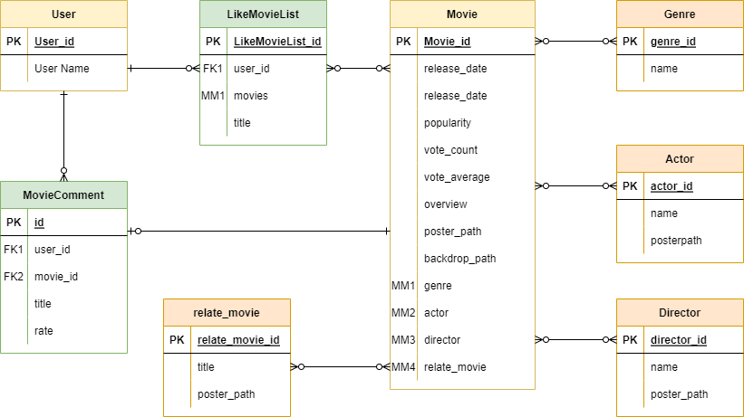
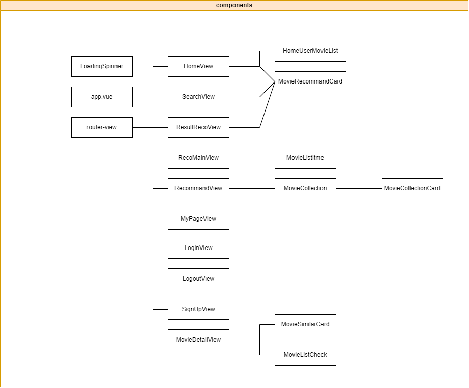

# Final_Project 🎞

영화 정보를 제공 및 추천 프로젝트 입니다.

영화의 정보를 제공하는 SSAFY 1학기의 마지막 프로젝트 입니다. 영화에 코멘트 작성 기능과 자신만의 영화리스트 만들기가 가능한 커뮤니티 기능이 포함됐습니다.

SSAFY에서 처음으로 진행하는 협업 프로젝트 이므로 먼저 기본적으로 구현이후 UI/UX에 더 많은 비중을 두는 것을 목표로 하였습니다. 기본적인 기능을 구현하면서 의논 하였던 것은 UI/UX의 부분의 의논이 많았습니다. 웹페이지를 제작하며 사용자에게 어떤 경험을 주고 그 경험을 주기 위해 UI와 back-server에서는 어떤 DB를 보내주어야 하는가에 대 많이 의논하고 여러 아이디어가 나오고 구현하고 싶은 기능들이 많이 나왔기에 정리해가며 프로젝트를 시작하였습니다.

구현하고 싶은 것이 많이 나왔지만 프로젝트 제출 날짜가 정해져 있으므로 유튜브의 재생목록 시스템에 영감을 받아 사용자가 찜목록을 생성하고 각 목록에 여러 영화를 저장할수 있는 기능을 구현하기로 하였습니다. 사용자가 사용에 익숙한 시스템을 너어 좀더 편한 영화목록 생성을 통해 사용자에게 좋은 경험을 시켜주는 것을 목표로 하였습니다.

## 팀원 ⌨

###### 팀장: 용승민
- 주로 백서버를 당담하였습니다. 모델작성 장고 url 및 views 를 작성하였습니다.

###### 팀원: 김예은
- 주로 프론트 서버를 담당하였습니다. vue의 각 라우터와 component들 및 페이지의 html 및 css를 작성하였습니다.
## 프로젝트 진행 과정⚙

- 메인 페이지와 DB🧨

  - 프로젝트를 성공적으로 시작하기 위해서 만들어야 했던 두가지라고 생각합니다. 먼저 메인페이지의 구성을 생각하고 이에 따라 DB를 tmdb에서 받아와 50개의 작은 DB를 구성하여 메인 페이지로 보내 보았습니다.
  - DB를 구성하면서 어떤 정보를 가져와야 하는지 정하지 않고 가져와 문제가 발생했습니다. 상세페이지 구성을 위한 페이지 작성을 시작하였을 때 DB에 원하는 정보를 넣어주지 않아 다시 모델을 작성했습니다.

- 상세 페이지와 DB작성📃

  - 상세 페이지 구성시 필요한 정보들과 추가적으로 원하는 정보들을 DB에 저장할 필요를 느꼈습니다.
  - 원하는 정보를 위해 backend에 필요한 모델을 작성해 주었습니다.
    
  - 필요한 DB를 구성하기위해 Python으로 여러 request를 보내주었습니다.
    [&#39;DB를 작성하기위한 python file&#39;](https://lab.ssafy.com/yongsm295/final-pjt/-/blob/main/final-pjt-back/request.py)
  - 9966개의 영화 DB를 구현하였습니다.

##### 필수요소! 추천알고리즘! 🛠

이번 프로젝트에서는 추천알고리즘을 필수로 구현해야했습니다. 논의 끝에 최근접 이웃 기반 필터링 기능을 이용한 추천 알고리즘을 구현하기로 결정했습니다.

- 최근접 이웃 기반 필터링 : 사용자-아이템 행렬에서 사용자가 아직 평가하지 않은 아이템을 예측하는 것이 목표

아이템으로 영화 장르를 선택하여 장르를 통해 다른 영화를 추천하는 방식을 이용했습니다.

- 추천페이지에서 영화를 골라 보내준다.
- 받은 영화제목의 index를 뽑아낸다.
- 코사인 유사도 중 영화 제목 인덱스에 해당하는 값에서 추천영화를 추출한다.
  - 행렬 분해를 기반하여 사용한다. 이 방법은 python pandas의 pivot table로 지원해준다.
- 이 때 여러 영화가 들어오면 각각 추출한다.
- 추출한 영화 중 중복이 있다면 중복을 우선으로 정렬하고 rating을 적용한 추천점수 기반으로 정렬한다.
- 정렬된 영화 중 5개를 추천해준다.

```python
def find_movie():
    pd.set_option('display.max_rows', 10000) # 행설정
    pd.set_option('display.max_columns', 10000) # 열 설정
    pd.set_option('display.width', 10000) # 출력 창 넓이 설정

    data = pd.read_csv('movieitem.csv', encoding='UTF-8') # 영화정보가 담긴 csv파일
    data = data[["title", "release_date", "popularity","vote_count","vote_average","genres","actor","director","id"]]
    m = data["vote_count"].quantile(0.9) 

'''
투표수가 많을수록 사람들이 많이 보고 평가한 영화 이런 영화중 많은 투표로 인해 
투표 점수가 낮을 수 있다 이러한 불공정을 처리하기 위해 가중치를 두었다.
이때 이 가중치 처리 식 가중 평점(WR) = (v ÷ (v+m)) × R + (m ÷ (v+m)) × C 여기에서:

R = 영화의 평균(평균) = (등급)
v = 영화에 대한 투표 수 = (votes)
m = 상위에 포함되기 위해 필요한 최소 투표 수
C = 전체 보고서의 평균 투표
출처 : https://www.quora.com/How-does-IMDbs-rating-system-work
'''

    # data = data.loc[data["vote_count"] >= m]
    C = data['vote_average'].mean()

    def weighted_rating(x,m=m,C=C):
        v=x["vote_count"]
        R=x['vote_average']
        return (v/(v+m)*R)+(m/(m+v)*C)


    data['recommed_count']=data.apply(weighted_rating,axis=1) #list와 dict형태로 만들고
    data['genres'] = data['genres'].apply(literal_eval)
    data['genres']=data['genres'].apply(lambda x : [d['name'] for d in x]).apply(lambda x: " ".join(x))
	# list 형태에서 string형태로 만들었다.

    data.to_csv('data2.csv')
    count_vector = CountVectorizer(ngram_range=(1,3))
    c_vector = count_vector.fit_transform(data['genres'])
      #코사인 유사도를 구한 벡터를 미리 저장
    sparse.save_npz("yourmatrix.npz", c_vector)
```

위에 구한 코사인 유사도를 저장시킨 파일을 불러 영화를 추천해주었습니다.
[&#39;영화 추천 알고리즘 파일&#39;](https://lab.ssafy.com/yongsm295/final-pjt/-/blob/main/final-pjt-back/movies/recommande_movie.py)

## DB완성! 프론트구현 📢

- 컴포넌트를 직접 구성하고 레이아웃을 배치하며 필요한 DB가 무엇인지 정확히 알 수 있었습니다. DB작성이 끝난 후 본격적으로 frontend 작업을 시작하였습니다.
  
- 완성되면 사진넣을 곳

- 프론트를 구현하면서 가장 중점을 둔 것은 기존 영화나 영상 제공 사이트에서 편리함을 느꼈던 디자인을 차용하되,
사용자가 시각적으로 정보를 효율적으로 수집하고 어떻게 서비스를 효과적으로 이용할 수 있는 가에 관한 것이었습니다.

- 웹페이지의 배경색은 어두운 회색으로 지정하였습니다. 이용자가 영상을 시청할 때는 주로 어두운 환경이기 때문에 눈의 피로를 주지 않고 영상으로 넘어가기 위해서는 어두운 톤으로 색상을 맞추는 것이 좋을 것이라고 판단했습니다.
디자인적으로 명시도를 높이고 강조를 위해 key color는 파랑색을 사용했습니다.

- 네비게이션 바에는 로고와 라우터 링크를 배치했습니다.
각각 메인화면, 영화추천, 마이페이지, 계정과 관련한 기능을 이용할 수 있고,
중간에 검색창을 넣어 영화를 검색해서 필요한 정보를 찾을 수 있도록 구현했습니다.


- 회원가입/로그인

회원가입 페이지에서는 간단하게 정보를 입력할 수 있도록 구성하고, 중복 유저 이름인 경우 경고 알람을 배치했습니다. 또 비밀번호가 틀리거나, 정보의 일부를 입력하지 않은 경우 프론트엔드에서 require라는 속성을 이용해 알람을 발생시켜 정보를 빠짐없이 입력할 수 있도록 했습니다. 

- 메인화면

메인화면에서는 랜덤한 이미지를 통해 영화를 추천하고, 최근 상영 중인 영화와 인기순의 영화를 확인할 수 있도록 구성했습니다. 로그인 한 경우 자신이 컬렉션에 담은 영화를 기반으로 랜덤 영화를 추천하고, 자신의 컬렉션을 확인할 수 있도록 구성했습니다. 무비 카드를 마우스 오버하면 영화 제목을 확인할 수 있고 클릭 시 디테일 페이지로 넘어갈 수 있습니다.

- 디테일 페이지
디테일은 영화와 관련해 가장 다양한 정보를 얻을 수 있도록 구성했습니다. 기본적인 영화 포스터와 배경이미지를 배치하고 제목과 개봉연도, 영화 API를 가져온 TMDB의 별점, 장르, 줄거리, 감독과 배우까지의 정보를 담았습니다. 추가적으로 사이드 바에는 유튜브 영상 확인과 댓글작성, 컬렉션을 추가하여 영화와 관련해 이용자가 추가적인 정보 습득이나 커뮤니티 이용, 자신만의 정보를 생성할 수 있도록 배치했습니다.

장르의 경우에는 클릭 시에 DB에 저장된 동일 장르의 영화를 인기 순으로 볼 수 있도록 정렬하였고,
감독과 배우의 경우네는 클릭 시에 DB에 저장된 감독의 연출작이나 배우의 출연작을 확인할 수 있도록 구성했습니다.

줄거리의 쉽고 빠르게 필요한 정보를 습득할 수 있도록 원하는 경우에만 확인할 수 있게 드롭다운으로 구성했습니다.

영화의 디테일을 확인 한 이후 장르를 기반으로 비슷한 영화 세 개를 추천하고 하단에는 댓글을 볼 수 있는 구역을 구성했습니다.

사이드바의 댓글 작성은 모달창을 통해 영화의 이름을 확인하고 별점과 내용을 작성할 수 있도록 했습니다.
사이드바의 컬렉션은 모달창을 통해 사용자가 새로운 컬렉션을 생성하거나 기존의 컬렉션에 해당 영화를 추가할 수 있도록 구성했습니다. 체크박스로 컬렉션에 추가하는 만큼 확실하게 정보를 전달하기 위해 alert를 통해 컬렉션 추가와 삭제를 표시했습니다. 또한 로그인한 사용자만 컬렉션을 볼 수 있도록 했습니다.

- 마이페이지
마이페이지는 로그인 되어있지 않은 경우 로그인 하도록 설정해놨습니다.
마이페이지에서는 내가 작성한 댓글과 컬렉션을 확인할 수 있는 곳입니다.
시간적 여유가 있었다면 팔로워/팔로잉 기능이나 추가적인 아티클 생성을 하고 싶었으나 아쉽게 다른 기능과 연결된 부분만 볼 수 있도록 구현했습니다.

내 댓글의 경우 작성한 댓글을 볼 수 있고 , 클릭시에 댓글을 단 영화로 넘어갈 수 있습니다.
내 컬렉션의 경우, 컬렉션에 담은 영화를 모아보고 컬렉션을 삭제할 수 있습니다.

- 영화 추천

영화 추천에서는 좋아하는 영화를 고르면 그 영화의 장르 데이터를 기반으로 콘텐츠 추천 알고리즘을 활용해 영화를 추천하는 방식을 이용했습니다. 처음 추천 페이지에 가면 랜덤으로 영화가 보여지고, 맘에 드는 영화가 없다면 버튼을 통해 다른 영화를 랜덤으로 확인하거나, 검색을 통해 원하는 영화를 찾을 수 있게 했습니다.

영화는 장바구니 처럼 담을 수 있고, 최대 7개까지 선택가능하도록 했습니다.
영화 선택이 마치면 버튼을 통해 최종 추천 페이지로 이동하며 추천하는 영화의 개수는 5개로 설정했습니다.


## 후기

##### 용승민

SSAFY공부를 시작하고 처음으로 구현해보는 협업 프로젝트였습니다. SSAFY에서 배운 모든것을 사용해보려 노력하였고 지금까지 해주셧던 수업에 지나가던 말들이 중요한순간에 필요하였습니다. 이 때 비로소 필요한 것을 느끼게 되었고 더 많이 공부할걸 이라는 아쉬움이 남고 제가 더 공부해야할 부분에대해 느끼게 해주는 좋은 기회 였습니다. 힘든 과정이였지만 좋은 팀원과 함께하여 즐거웠습니다. 부족함을 느낀만큼 다음 프로젝트전까지 많은 준비를 해야겠습니다.

##### 김예은

그동안 프로젝트에서 했던 것들을 모아서 홈페이지에 적용하게 되니 신기하고 재미있었습니다. 실습을 할 땐 이것이 왜 필요한지 궁금했는데 직접 홈페이지를 만들면서 필요한 기능을 구현하고 배치하는 데 모두 중요한 과정이었다는 것을 느꼈습니다. 이번 프로젝트에서는 프론트를 중심적으로 작성하였는데, 사용자가 더 편리하게 서비스를 이용하기 위해 디자인과 기능적으로 고민하면서 수정하고 팀원과 의논하는 과정에서 앞으로 다양한 프로젝트를 진행할 때 어떻게 하면 좋을지 익히고 이론을 적용하며 스스로 성장한 것 같은 뿌듯함도 느꼈습니다. 또한 주어진 과제 뿐 아닌 직접 필요하고 원하는 것을 찾으면서 다양한 것들을 배울 수 있었습니다. 팀원과 함께 협업하며 의견을 잘 조율할 수 있어서 고마웠고 최종적으로 원하는 기능들을 구현할 수 있어서 보람을 느꼈습니다. 아쉬운 부분도 있지만 주어진 기간내에 가장 필요한 부분을 우선적으로 처리하고 보여주는 것에 대한 고민도 해야겠다고 생각했습니다.

## 참고


1) "딥 러닝 - 영화 추천 시스템"  Isnaghada https://velog.io/@skarb4788/
2)  "추천 시스템(Recommendation system)이란? - content based filtering, collaborative filtering" 꿈 많은 사람의 이야기 https://lsjsj92.tistory.com/563
